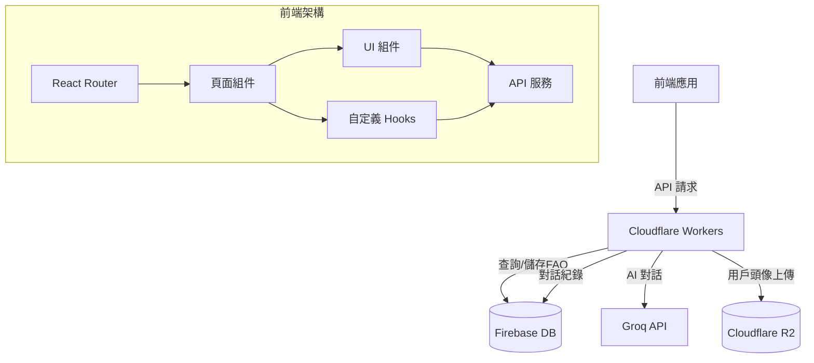
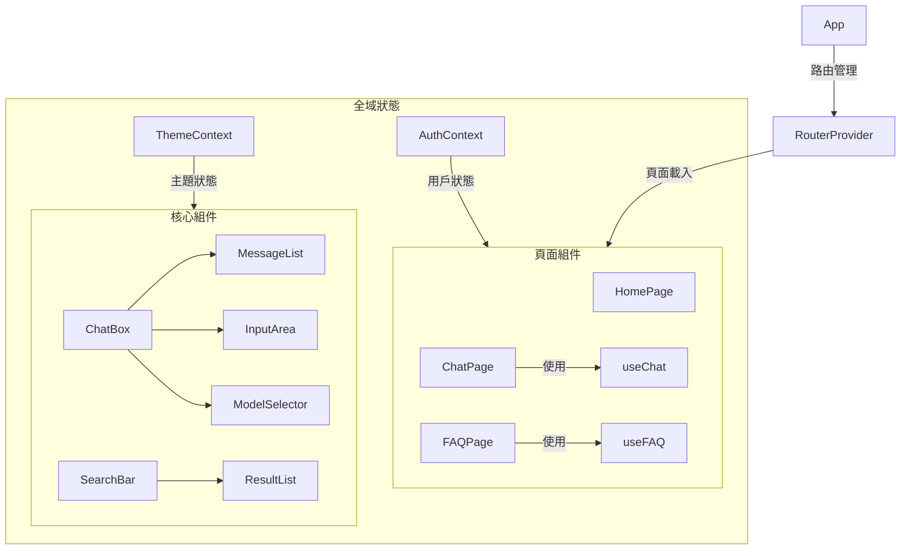
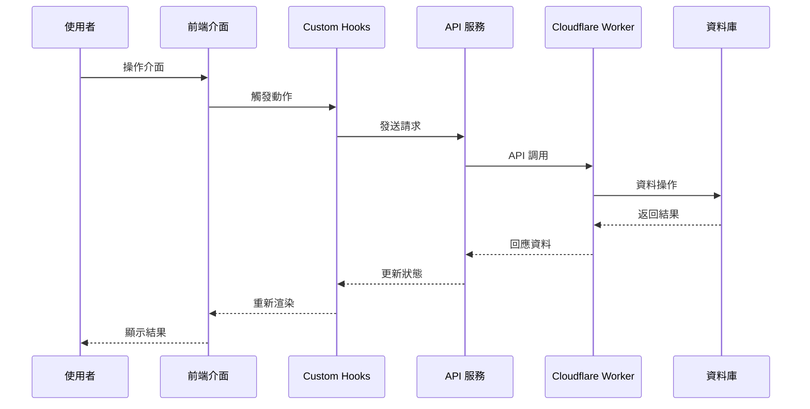
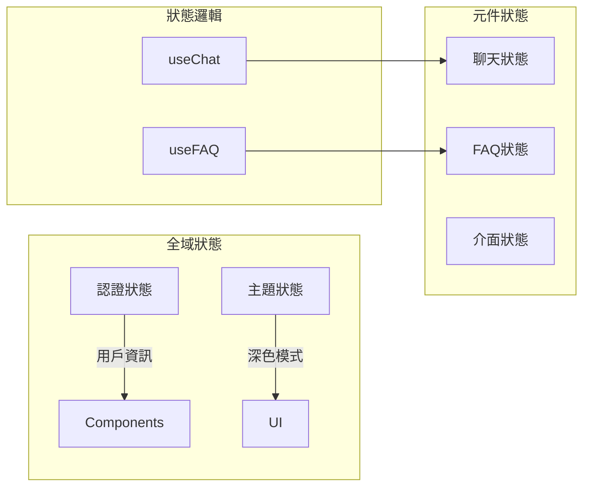

# EchoMind（回聲心語）- AI 助理網站

## 🎯 專案目標

開發一個整合 AI 的教育助理網站，提供：

1. **FAQ 智能查詢**：自動解析學生問題，擴展關鍵詞查詢
2. **AI 關懷對話**：提供個人化諮詢和情感支持
3. **教育資源推薦**：根據對話內容推薦相關學習資源

## 🛠 技術架構

### 前端技術
- **框架**：React + Vite
- **樣式**：Tailwind CSS + HeadlessUI
- **動畫**：Framer Motion
- **路由**：React Router DOM

### 後端服務
- **主要後端**：Cloudflare Workers
- **資料庫**：
  - Firebase Realtime Database(FAQ 資料)
  - Firebase Realtime Database (對話紀錄)
- **AI 模型**：Groq API (LLM 處理)
- **儲存空間**：Cloudflare R2 (用戶頭像)

### 部署
- Cloudflare Pages (前端)
- Cloudflare Workers (API)

## 🏗 系統架構

### 整體架構圖



### 元件關係圖



### 資料流向圖



### 狀態管理



## 🔄 主要資料流程

### 1. 使用者認證流程
- 登入/註冊請求 → AuthContext → Firebase Auth → 更新全域狀態
- 權限驗證 → RouteGuard → 路由重導向

### 2. 聊天功能流程
- 使用者輸入 → ChatBox → useChat Hook → Groq API → 更新訊息列表
- 歷史記錄 → Firebase Realtime Database → ChatHistoryList → 顯示對話記錄

### 3. FAQ 查詢流程
- 關鍵字輸入 → SearchBar → useFAQ Hook → D1 資料庫 → 顯示結果
- AI 輔助搜尋 → Groq API → 擴展查詢 → 更新搜尋結果

### 4. 狀態管理策略
- 全域狀態：使用 Context API 管理用戶資訊和主題設定
- 元件狀態：使用 useState 管理局部 UI 狀態
- 共用邏輯：透過自定義 Hooks 封裝狀態邏輯

## 📂 專案結構

```
src/
├── components/      # UI 元件
│   ├── Chat/       # 聊天相關元件
│   │   ├── ChatBox.jsx
│   │   ├── MessageList.jsx
│   │   └── InputArea.jsx
│   │
│   ├── FAQ/        # FAQ 相關元件
│   │   ├── SearchBar.jsx
│   │   └── ResultList.jsx
│   │
│   └── UI/         # 通用 UI 元件
│       ├── Button.jsx
│       └── Loading.jsx
│
├── pages/          # 頁面組件
│   ├── Home.jsx
│   ├── Chat.jsx
│   └── FAQ.jsx
│
├── services/       # API 服務
│   ├── chatService.js
│   └── faqService.js
│
├── hooks/          # 自定義 Hooks
│   ├── useChat.js
│   └── useFAQ.js
│
└── utils/          # 工具函數
    ├── api.js
    └── helpers.js
```

## 🚀 開始使用

### 1. 安裝依賴

```bash
# 建立專案
npm create vite@latest echomind -- --template react

# 安裝核心依賴
npm install react-router-dom @headlessui/react @heroicons/react
npm install framer-motion classnames date-fns

# 安裝開發依賴
npm install -D tailwindcss postcss autoprefixer
```

### 2. 環境設置

建立 `.env` 文件：

```env
VITE_GROQ_API_KEY=your_api_key
VITE_WORKER_URL=your_worker_url
```

### 3. 配置 Cloudflare

1. 設置 Cloudflare Workers
2. 建立 D1 資料庫
3. 配置 KV 命名空間

## 📈 開發時程

| 階段 | 工作內容 | 時間 |
|------|---------|------|
| 1 | 基礎架構搭建 | 1週 |
| 2 | FAQ 系統開發 | 2週 |
| 3 | AI 對話功能 | 2週 |
| 4 | UI/UX 優化 | 1週 |
| 5 | 測試與部署 | 1週 |

## 🔒 安全性考量

1. API 請求限制
2. 用戶資料加密
3. 對話內容過濾
4. 錯誤處理機制

## 📝 待辦事項

- [ ] 建立基礎專案結構
- [ ] 設計資料庫架構
- [ ] 實作 FAQ 搜尋功能
- [ ] 整合 Groq API
- [ ] 開發聊天介面
- [ ] 加入使用者認證
- [ ] 實作對話紀錄
- [ ] 部署測試環境

## 🤝 貢獻指南

1. Fork 專案
2. 建立功能分支
3. 提交變更
4. 發起 Pull Request

## 📄 授權

本專案採用 MIT 授權條款